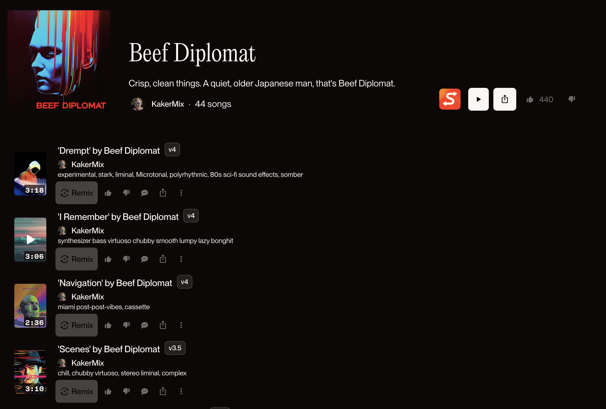
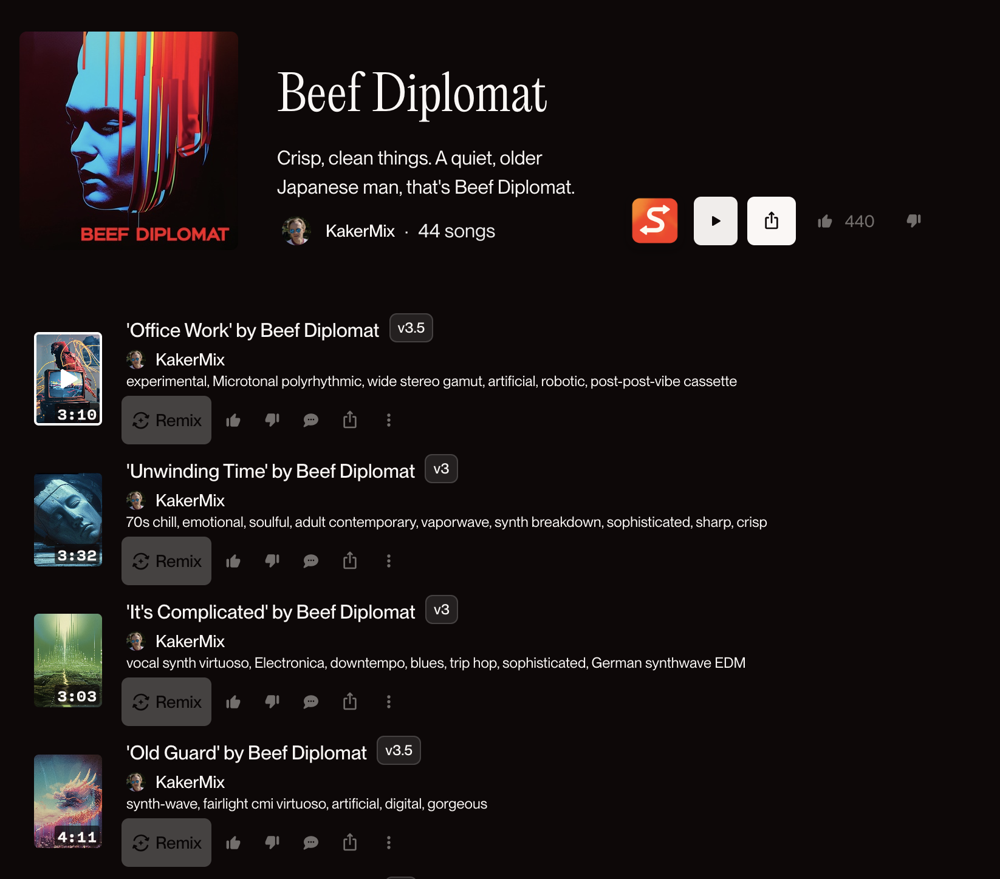

  
  <h1>Suno Shuffle</h1>
  
A lightweight Chrome extension that adds one-click shuffle functionality to suno.com playlist page.

  
  
  

## How It Works

Suno Shuffle is designed to be as lightweight as possible:

1. **Simple Integration**: Adds a shuffle button to Suno's playlist interface
2. **Instant Shuffling**: Click the button to randomize the track order
3. **Page Refresh**: The page will automatically refresh and apply the new order and begin playing!
4. **No Tracking**: Works entirely in your browser with no data collection

> **Note**: The page refresh is intentional and necessary to ensure the new track order is properly applied in Suno's player. Will try to make this worker better in a future release!

## Screenshots

### 1. Original Playlist View

*Your playlist in its original order*

### 2. Shuffle Button

*The shuffle button appears in the playlist controls*

### 3. Shuffled Playlist

*After clicking the shuffle button, the playlist is randomized*

## Features

- 🎵 One-click playlist shuffling
- 🔄 Seamless page refresh to apply changes
- 🎨 Native-looking UI that matches Suno's design
- 🚀 Lightweight and fast
- 🔒 No analytics, tracking, or external dependencies

## Installation

### From Chrome Web Store (Coming Soon)

### Manual Installation

1. Clone or download this repository
2. Open Chrome and go to `chrome://extensions/`
3. Enable "Developer mode" (toggle in top-right corner)
4. Click "Load unpacked" and select the extension directory

## Usage

1. Navigate to any Suno.ai playlist (e.g., [https://suno.com/playlist/8bae835f-4224-4e0d-addb-adc1f5cd43a5](https://suno.com/playlist/8bae835f-4224-4e0d-addb-adc1f5cd43a5))
2. Click the shuffle button in the playlist controls
3. The page will refresh with your newly shuffled playlist

## Contributing

Found a bug or have a feature request? Please [open an issue](https://github.com/nateblaine/suno-shuffle/issues) on GitHub.

## License

This project is licensed under the MIT License - see the [LICENSE](LICENSE) file for details.

---

  Made with ❤️ ☕️ 🤖 in Richmond, VA

